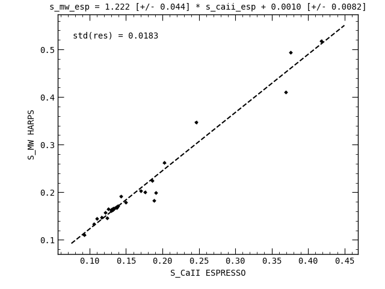

# pyrhk
Python script to calculate logR'HK for HARPS and ESPRESSO

What pyrhk can do:
- Calibrate S_CaII index values to S_MW for HARPS (using Lovis et al. 2011) or ESPRESSO (using a new calibration) spectrographs.
- Calculate logR'HK via Noyes et al. (1984) using two bolometric corrections:
    - Middelkoop (1982): for 0.44 < B-V < 1.20 (MS stars, widely used)
    - Rutten (1984):  for 0.3 < B-V < 1.6 (MS stars) and 0.3 < B-V < 1.7 (giant stars)
- Estimate gyrochronologic rotation period and age using relations from Noyes et al. (1984) and Mamajek & Hillenbrand (2008).
- Obtain B-V colour from Simbad (requires `astroquery` module installed).

### Calibration of SMW for ESPRESSO:

Using 27 stars with data from HARPS and ESPRESSO.
Will be updated as more data is available.
This is a preliminary calibration, use with care.

